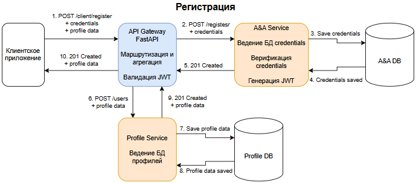
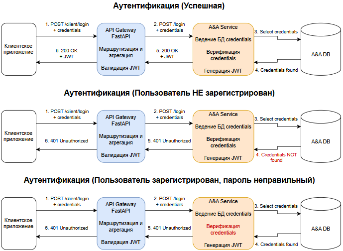
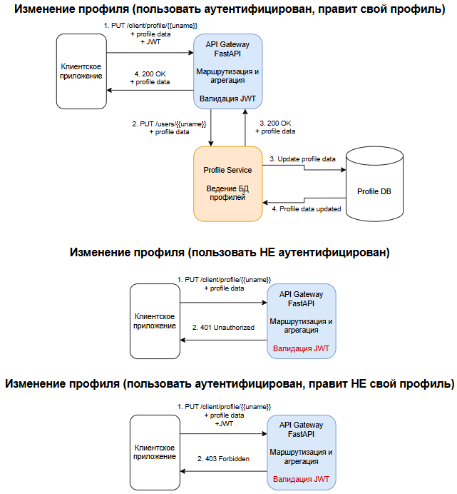

# Домашнее задание №7
## Stream processing

### Вариант 1 (С КОДОМ)

#### Реализовать сервис заказа. Сервис биллинга. Сервис нотификаций.

При создании пользователя, необходимо создавать аккаунт в сервисе биллинга. В сервисе биллинга должна быть возможность положить деньги на аккаунт и снять деньги.

Сервис нотификаций позволяет отправить сообщение на email. И позволяет получить список сообщений по методу API.

Пользователь может создать заказ. У заказа есть параметр - цена заказа.

Заказ происходит в 2 этапа:

сначала снимаем деньги с пользователя с помощью сервиса биллинга
отправляем пользователю сообщение на почту с результатами оформления заказа. Если биллинг подтвердил платеж, должно отправиться письмо счастья. Если нет, то письмо горя.

Упрощаем и считаем, что ничего плохого с сервисами происходить не может (они не могут падать и т.д.). Сервис нотификаций на самом деле не отправляет, а просто сохраняет в БД.

#### ТЕОРЕТИЧЕСКАЯ ЧАСТЬ:

0) Спроектировать взаимодействие сервисов при создании заказов. Предоставить варианты взаимодействий в следующих стилях в виде sequence диаграммы с описанием API на IDL:

только HTTP взаимодействие
событийное взаимодействие с использование брокера сообщений для нотификаций (уведомлений)
Event Collaboration cтиль взаимодействия с использованием брокера сообщений
вариант, который вам кажется наиболее адекватным для решения данной задачи. Если он совпадает одним из вариантов выше - просто отметить это.

#### ПРАКТИЧЕСКАЯ ЧАСТЬ:

Выбрать один из вариантов и реализовать его.

На выходе должны быть

I) описание архитектурного решения и схема взаимодействия сервисов (в виде картинки)

II) команда установки приложения (из helm-а или из манифестов). Обязательно указать в каком namespace нужно устанавливать.

III) тесты постмана, которые прогоняют сценарий:

Создать пользователя. Должен создаться аккаунт в биллинге.
Положить деньги на счет пользователя через сервис биллинга.
Сделать заказ, на который хватает денег.
Посмотреть деньги на счету пользователя и убедиться, что их сняли.
Посмотреть в сервисе нотификаций отправленные сообщения и убедиться, что сообщение отправилось
Сделать заказ, на который не хватает денег.
Посмотреть деньги на счету пользователя и убедиться, что их количество не поменялось.
Посмотреть в сервисе нотификаций отправленные сообщения и убедиться, что сообщение отправилось.

В тестах обязательно

наличие {{baseUrl}} для урла
использование домена arch.homework в качестве initial значения {{baseUrl}}


### ПОДГОТОВКА
#### в /etc/hosts прописываем
```
127.0.0.1 arch.homework 
```

#### Запускаем docker
У меня docker desktop с виртуализацией VT-d

#### Запускаем minikube
```
minikube start --driver=docker
```

#### NGINX ingress controller (если его нет в кластере)
##### Создать namespace под ingress controller
```
kubectl create namespace nginx
```
##### Установка чарта NGINX
```
helm repo add ingress-nginx https://kubernetes.github.io/ingress-nginx/
```
```
helm repo update
```
```
helm install nginx ingress-nginx/ingress-nginx --namespace nginx -f ./nginx/nginx_values.yaml
```

#### Генерируем закрытый и открытый ключи у себя на машине (лучше заранее создать в директории проекта папку ./etc/keys)
```
openssl genrsa -out ./etc/keys/jwt-private.pem 2048
```
```
openssl rsa -in ./etc/keys/jwt-private.pem -pubout -out ./etc/keys/jwt-public.pem
```

#### Создаем в кластере namespace под каждый сервис
##### Для сервиса аутентификации
```
kubectl create namespace auth
```
##### Для API Gateway 
```
kubectl create namespace client
```
##### Для сервиса профилей 
```
kubectl create namespace profile
```
##### Для сервиса биллинга
```
kubectl create namespace billing
```
##### Для сервиса заказов
```
kubectl create namespace order
```


### УСТАНОВКА СЕРВИСОВ

#### СЕРВИС АУТЕНТИФИКАЦИИ (A&A Service)

##### "Внешняя" поставка секретов в кластер
###### Секрет с ключами для подписания токенов
```
kubectl create secret generic jwt-signing-keys --from-file=private.pem=./etc/keys/jwt-private.pem --from-file=public.pem=./etc/keys/jwt-public.pem -n auth
```
###### Секрет с данными для подключения к БД
```
kubectl apply -f ./secrets/auth_secret.yaml -n auth
```

##### Зависимости HELM-чарта (PostgreSQL)
###### Переходим в директорию с чартом
```
cd ./services/auth-app
```
###### Загружаем зависимости
```
helm dependency update
```
###### Возвращаемся в корень
```
cd ../../
```

##### Устанавливаем чарт с A&A сервисом
```
helm install auth ./services/auth-app -n auth
```

#### СЕРВИС ПРОФИЛЕЙ (Profile Service)
##### "Внешняя" поставка секрета в кластер
```
kubectl apply -f ./secrets/users_secret.yaml -n profile
```

##### Зависимости HELM-чарта (PostgreSQL)
###### Переходим в директорию с чартом
```
cd ./services/users-app
```
###### Загружаем зависимости
```
helm dependency update
```
###### Возвращаемся в корень
```
cd ../../
```

##### Устанавливаем чарт с Profile сервисом
```
helm install profile ./services/users-app -n profile
```

#### СЕРВИС БИЛЛИНГА (Billing)
##### "Внешняя" поставка секрета в кластер
```
kubectl apply -f ./secrets/billing_secret.yaml -n profile
```

##### Зависимости HELM-чарта (PostgreSQL)
###### Переходим в директорию с чартом
```
cd ./services/billing-app
```
###### Загружаем зависимости
```
helm dependency update
```
###### Возвращаемся в корень
```
cd ../../
```

##### Устанавливаем чарт с сервисом
```
helm install billing ./services/billing-app -n billing
```


#### СЕРВИС ЗАКАЗОВ (ORDERS)
##### "Внешняя" поставка секрета в кластер
```
kubectl apply -f ./secrets/order_secret.yaml -n profile
```

##### Зависимости HELM-чарта (PostgreSQL)
###### Переходим в директорию с чартом
```
cd ./services/orders-app
```
###### Загружаем зависимости
```
helm dependency update
```
###### Возвращаемся в корень
```
cd ../../
```

##### Устанавливаем чарт с сервисом
```
helm install order ./services/orders-app -n order
```


#### API Gateway

##### "Внешняя" поставка секретов в кластер
###### Секрет API Gateway с ключом для валидации токенов
```
kubectl create secret generic jwt-validation-key --from-file=public.pem=./etc/keys/jwt-public.pem -n client
```

##### Устанавливаем чарт API Gateway
```
helm install client ./services/client-api -n client
```


#### Включаем (и не закрываем терминал)
```
minikube tunnel
```

#### Проверяем health-check (в новом окне терминала)
```
curl http://arch.homework/client/health/
```
##### К остальным сервисам доступ "снаружи" не предполагается

#### Запускаем тестовую коллекцию
```
newman run ./postman/HW6.json
```

### Обязанности сервисов:
#### A&A (Authentication & Authorization) Service
- Ведение БД учетных данных (credentials)
- Аутентификация пользователей по credentials
- Генерация JWT-токенов

#### Profile Service
- Ведение БД данных профилей (почта, телефон, ФИО и т.п.)

#### Client API Gateway
- Единая точка доступа для клиента
- Маршрутизация запросов между остальными сервисами
- Валидация JWT (подпись, время жизни, сверка логина запрошенных профилей с логином в JWT)

### Схема взаимодействия сервисов (красным в сценариях с ошибкой - этап обнаружения ошибки)







### КАК УДАЛИТЬ
#### Удаляем развернутые чарты
```
helm uninstall client -n client
```
```
helm uninstall auth -n auth
```
```
helm uninstall profile -n profile
```
```
helm uninstall billing -n billing
```
```
helm uninstall order -n order
```

#### Удаляем секреты
```
kubectl delete secret jwt-validation-key -n client
```
```
kubectl delete secret jwt-signing-keys -n auth
```
```
kubectl delete secret auth-db-secret -n auth
```
```
kubectl delete secret users-db-secret -n profile
```
```
kubctl delete secret billing-db-secret -n billing
```
```
kubctl delete secret orders-db-secret -n billing
```

#### Удаляем PVC, оставшиеся от БД (если не хотим сохранить данные в PV)
```
kubectl delete pvc -l app.kubernetes.io/name=auth-postgresql,app.kubernetes.io/instance=auth -n auth
```
```
kubectl delete pvc -l app.kubernetes.io/name=users-postgresql,app.kubernetes.io/instance=profile -n profile
```
```
kubectl delete pvc -l app.kubernetes.io/name=billing-postgresql,app.kubernetes.io/instance=billing -n billing
```
```
kubectl delete pvc -l app.kubernetes.io/name=orders-postgresql,app.kubernetes.io/instance=order -n order
```


#### Удаляем PV, оставшиеся от БД (если reclaimPolicy: Retain)
```
kubectl get pv -n <namespace>
```
Смотрим вывод, узнаем <имя PV> (к сожалению, меток у него не будет - я проверил)
```
kubectl delete pv <имя PV> -n <namespace>
```

#### Удаление NGINX и namespace'ов
Можно, но не принципиально

### Готово!